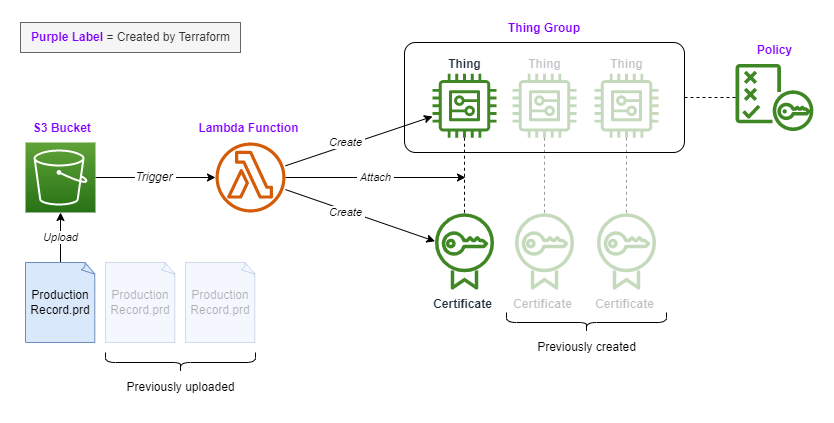

# AWS-Terraform-Onboarding

This repository explains the AWS cloud onboarding workflow that follows
device provisioning with SDP, using the production records to register
each device.



## AWS Account Setup

Create an AWS account. You should either log in as the Root User with
full permissions or, more correctly, create a User with the minimum set of
permissions to run this project. The minimum permission policies required
for the User are:

`AmazonS3FullAccess`
`AWSLambda_FullAccess`
`IAMFullAccess`
`AWSIoTConfigAccess`
`IAMAccessAnalyzerFullAccess`

## Project Configuration

Create an Access Key for the AWS User. Run the following commands from the
repository root to configure the devcontainer to pull in the User
credentials as environment variables:

```bash
cp .devcontainer/devcontainer.env.example .devcontainer/devcontainer.env
sed -i 's/=id/=<youraccesskeyid>/' .devcontainer/devcontainer.env
sed -i 's/=secret/=<yoursecretaccesskey>/' .devcontainer/devcontainer.env
sed -i 's/=public_key/=<yourpublicsigningkey>/' .devcontainer/devcontainer.env
```
When you open the repository in VSCode it will now automatically pull in your
User's credentials. The .gitignore file is set to ignore all .env files avoid
this information accidentally being committed to version control.

## Running Terraform to Create Onboarding Infrastructure

Run the following sequence of commands to set up the onboarding infrastructure:

```bash
cd resourcemanagement
terraform init
terraform apply
```
Terraform will print the resources it is going to create on your AWS account
on the terminal. Type `yes` to confirm the creation of the resources. Your
onboarding service is now ready to receive production record files.

You can upload production records to the S3 bucket in the AWS cloud console or
using the AWS CLI command below:

```bash
aws s3 cp <your .prd file> s3://<your bucket name>
```

## Bringing Down the Onboarding Infrastructure

The following command will destroy the Lambda function and the S3 bucket:

```bash
terraform destroy
```
To delete any Thing and Certificate resources created by the Lambda function,
run the delete_iot_resources.py script:

```bash
poetry install
poetry run python delete_iot_resources.py <your resource region> <your thing group name>
```

## Changing Default Terraform Variables

The variables.tf file declares variables related to AWS resource creation
and assigns default values. If you would like to change the default values,
it is recommended to create a terraform.tfvars file in this directory for
variable reassignment, rather than changing the default values in this
file. For example, to create resources in a different region, create a
terraform.tfvars file and add the following:

aws_region = "us-east-1"

Note that .tfvars files should not be added to version control for security
reasons.
