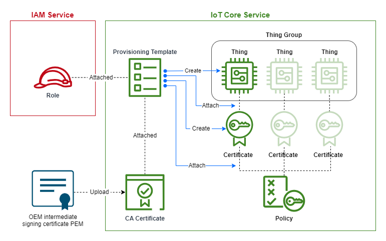

# Just-in-Time Onboarding

This README explains the AWS cloud onboarding workflow for just-in-time
onboarding.

***Ensure that you have followed the Account Setup steps in the top level
README before running this implementation.***



## Running Terraform to Create Onboarding Infrastructure

Open the repository as a devcontainer in VSCode and run the sequence of
commands below to set up the onboarding infrastructure.

Note: You must provide the intermediate certificate corresponding with the
private key that signed your IoT device certificates.

```bash
cd just_in_time_onboarding
echo intermediate_cert=\"<your intermediate certificate in .pem format>\" > terraform.tfvars
terraform init
terraform apply
```

Terraform will print the resources it is going to create on your AWS account
to the terminal. Type `yes` to confirm the creation of the resources.

## Bringing Down the Onboarding Infrastructure

The following command will destroy the resources created in the section above:

```bash
terraform destroy
```

To delete any Thing and Certificate resources created by the Provisioning Template,
run the ````delete_things_in_group.py``` script found in the ```utils/```
folder:

```bash
poetry install
poetry run python delete_things_in_group.py <your resource region> <your thing group name>
```

## Changing Default Terraform Variables

The variables.tf file declares variables related to AWS resource creation and
assigns default values. If you would like to change the default values, it is
recommended to use a terraform.tfvars file in this directory for variable
reassignment, rather than changing the default values in this file. For
example, to create resources in a different region, create a terraform.tfvars
file and add the following:

```aws_region = "us-east-1"```

Note that .tfvars files should not be added to version control for security
reasons.
