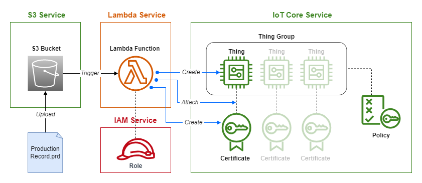

# Manual Onboarding

This README explains the AWS cloud onboarding workflow that follows device
provisioning with SDP, using the production records to register each device.

***Ensure that you have followed the Account Setup steps in the top level
README before running this implementation.***

## Project Overview



As shown in the diagram above, Terraform is used to create an **S3 bucket**,
a **Lambda Function**, a **Thing Group** and an iot **Policy**. eSecIP
production records can then be uploaded to the **S3 bucket**. An uploaded
file will trigger an execution of the **Lambda Function**.

The **Lambda Function** first validates the production record signature using
the public signing key. If valid, it will then extract the unique device ID
and device X.509 certificate. The device ID is used to create a **Thing** on
the **IoT Core** service. The device X.509 certificate is used to create a
**Certificate** on the **IoT Core** service. The **Lambda Function** code can
be found in ```runtimescript/runtimescript.py```. Once this process is
complete, the **Lambda Function** will delete the production record file from
the **S3 bucket**.

## Running Terraform to Create Onboarding Infrastructure

Open the repository as a devcontainer in VSCode and run the sequence of
commands below to set up the onboarding infrastructure. Note that you must
provide the public part of the key used to signed your production records in
hex string format.

```bash
cd manual_onboarding
echo public_key=\"<Your public key (in hex string format).>\" > terraform.tfvars
terraform init
terraform apply
```

Terraform will print the resources it is going to create on your AWS account
to the terminal. Type `yes` to confirm the creation of the resources. Your
onboarding service is now ready to receive production record files.

You can upload production records to the S3 bucket in the AWS cloud console or
using the AWS CLI command below:

```bash
aws s3 cp <your .prd file> s3://<your bucket name>
```

## Bringing Down the Onboarding Infrastructure

The following command will destroy the Lambda function and the S3 bucket:

```bash
terraform destroy
```

To delete any Thing and Certificate resources created by the Lambda function,
run the ````delete_things_in_group.py``` script found in the ```utils/```
folder:

```bash
poetry install
poetry run python delete_things_in_group.py <your resource region> <your thing group name>
```

## Changing Default Terraform Variables

The variables.tf file declares variables related to AWS resource creation and
assigns default values. If you would like to change the default values, it is
recommended to use a terraform.tfvars file in this directory for variable
reassignment, rather than changing the default values in this file. For
example, to create resources in a different region, create a terraform.tfvars
file and add the following:

```aws_region = "us-east-1"```

Note that .tfvars files should not be added to version control for security
reasons.
