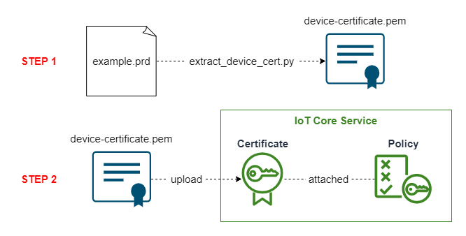

# Manual Onboarding at Development Scale

This README explains the AWS cloud onboarding workflow that follows device
provisioning with SDP, using the production records to register each device.

***Ensure that you have followed the Account Setup steps in the top level
README before running this implementation.***

## Project Overview



There are two steps to be performed. Firstly the extraction of the device
certificate in .pem format from the production record file. Secondly, the
creation of AWS resources, a **Certificate** attached to a **Policy**.

## STEP 1

Run the commands below within the development container encironment. Note that
you will need to provide the name of your .prd file as input to the decorder
script.

```bash
poetry install
poetry run python extract-device-cert.py "YOUR .PRD FILE" > "device-certificte.pem"
```

## STEP 2

Use Terraform to create the AWS resources by running the commands below:

```bash
cd manual_onboarding_development
terraform init
terraform apply
```

## Bringing Down the Onboarding Infrastructure

The following command will destroy the **Certificate** and **Policy**
resources that you created in STEP 2:

```bash
terraform destroy
```

## Changing Default Terraform Variables

The variables.tf file declares variables related to AWS resource creation and
assigns default values. If you would like to change the default values, it is
recommended to use a terraform.tfvars file in this directory for variable
reassignment, rather than changing the default values in this file. For
example, to create resources in a different region, create a terraform.tfvars
file and add the following:

```aws_region = "us-east-1"```

Note that .tfvars files should not be added to version control for security
reasons.
